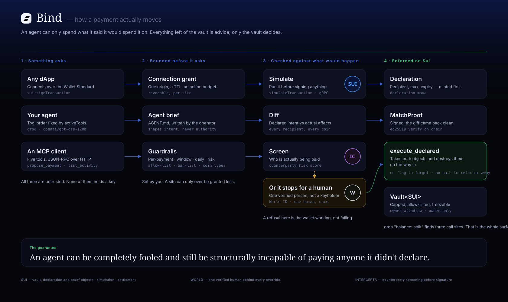

# Bind — pitch deck

**For:** whoever builds the slides (you), and through them a room of ETHGlobal Tokyo judges who
will see this for roughly four minutes and have seen nine agent-payment projects already today.

Everything below is slide-ready copy plus the reasoning behind it. Where a number appears, it is a
number this repo can actually produce — see [State of the build](#state-of-the-build) for what is
live and what isn't, and don't say on stage what that section doesn't back up.

---

## Design system

Lift these exactly; they're the same tokens the product uses, so the deck and the demo look like
one thing.

### Type

| Role | Font | Weight | Notes |
|---|---|---|---|
| Display / headlines | **Instrument Serif** | 400 | Only for the one big line per slide. |
| Everything else | **Bricolage Grotesque** | 300 / 400 / 600 / 700 | Body, labels, captions, numbers, code callouts. |
| Code | ui-monospace / SF Mono | 400 | Only for real identifiers and function names. |

Bricolage Grotesque is the deck's voice — set body at 300–400 and let 600/700 do the emphasis.
Don't mix in a third family. Both are free on Google Fonts:

```
https://fonts.google.com/specimen/Bricolage+Grotesque
https://fonts.google.com/specimen/Instrument+Serif
```

In Google Slides or Keynote, install both locally first, then set the theme's heading font to
Instrument Serif and the body font to Bricolage Grotesque so every new slide inherits them.

### Colour

| Token | Hex | Use |
|---|---|---|
| Ink | `#05070c` | Slide background. Every slide. |
| Navy | `#0a1338` | Card fills |
| Navy lift | `#12256e` | Top-of-slide mesh glow |
| Accent | `#2454e8` | Structure, arrows |
| Accent bright | `#4f7bf0` | Links, active state, lane labels |
| Mist | `#eef3ff` | Display type |
| Body | `#a7b0cc` | Body copy |
| Faint | `#6b7394` | Captions, monospace |
| Good | `#33d17a` | Executed, verified, the chain layer |
| Warn | `#f5b942` | Stopped for a human |
| Danger | `#f04f5c` | Refused, the incidents |

Dark throughout. A single mesh-gradient glow at the top of each slide (radial, `#12256e` →
transparent) is the only decoration — it matches the product's hero.

### Rules

- One idea per slide. If a slide needs two sentences to explain, it's two slides.
- Never a bullet list longer than three items.
- Numbers get their own visual weight — set them in Instrument Serif at 2–3× the body size.
- No stock photography, no robot imagery, no hexagon-mesh blockchain clip art.

---

## The architecture diagram

**File:** [`docs/architecture.svg`](docs/architecture.svg) — 1680×1000, vector, dark, already set in
Bricolage Grotesque and Instrument Serif.



It reads left to right as the life of a single payment, in four stages:

1. **Something asks** — a dApp over the Wallet Standard, your agent, or an MCP client. All three are
   untrusted and none of them holds a key.
2. **Bounded before it asks** — the connection grant (one origin, a TTL, an action budget), the
   agent's brief, and the guardrails. A site can only ever be granted less than the envelope holds.
3. **Checked against what would happen** — simulate on Sui, diff declared intent against actual
   effects, screen the counterparty, and branch to a verified human when something doesn't match.
4. **Enforced on Sui** — a Declaration and a MatchProof, both destroyed by `execute_declared` on the
   way in.

### Sponsor logos

The three sponsor marks sit as **circular crops** on the exact node each one powers — Sui on
*Simulate* and across stage 4, Intercepta on *Screen*, World on *Or it stops for a human*. This is
the slide that answers "why are these sponsors in your stack?" without you having to say it: each
logo is attached to the thing it does, not parked in a row on a thank-you slide.

The diagram ships with **drawn rings** (brand-coloured circle + monogram) rather than logo files,
because an SVG `<image>` with a missing `href` paints a broken-image glyph straight over the ring.
To use the official marks:

1. Download from each sponsor's brand kit and save into `docs/logos/`:
   - `sui.png` — https://sui.io/brand-assets
   - `world.png` — https://world.org/brand
   - `intercepta.png` — https://intercepta.io (or the logo from their docs header)
2. In `docs/architecture.svg`, uncomment the `<image>` line under each ring. There are three, each
   marked `<!-- Official logo: ... -->`.
3. The clip path is already circular and `preserveAspectRatio="xMidYMid slice"` handles non-square
   source art, so any reasonably centred logo crops correctly with no editing.

Export for slides: open the SVG in a browser and print to PDF, or run
`rsvg-convert -w 3360 docs/architecture.svg -o architecture@2x.png` for a retina raster.

---

## Slide-by-slide

Eleven slides. The timings below add to **4:40**, so this is built for a five-minute slot.

For a three-minute slot, cut slides 3, 8 and 9 and trim the demo to the two refusals — that lands
at 3:05. Don't cut 5 (architecture) or 10 (the honest boundary); they're the two that do the most
work per second.

---

### 1 — Title · 0:10

> **Bind**
> The allowance wallet for AI agents.
>
> *An agent can only spend what it said it would spend it on.*

**Layout:** logo mark top-left. Display line centred, Instrument Serif, huge. One line of Bricolage
underneath in `#a7b0cc`. Sponsor row at the bottom in circle crops, small.

**Say:** "Bind is a wallet you hand to an AI agent. The agent can only spend what it declared it
would spend it on — and that's enforced by a Move contract, not by our code being careful."

---

### 2 — The wound · 0:35

> **Three times, the same failure.**
>
> **$330,000** · Grok/Bankr wallet, March 2025
> **$175,000** · the same wallet again, May 2026
> **$1,500,000,000** · Bybit, February 2025

**Layout:** three rows. Amount in Instrument Serif at 3× size, in `#f04f5c`. One line of Bricolage
explanation under each, in `#6b7394`.

**Say:** "An unsolicited object silently unlocked a higher permission tier, and an encoded
instruction in a reply redirected a payment. They *fixed* it after the first attack — and the fix
didn't survive a later rewrite, because it lived in application code. At Bybit, three
security-trained humans approved a screen that said 'routine transfer'. The signature authorised a
malicious contract upgrade."

**Note:** don't editorialise. The numbers do the work. Pause after the Bybit figure.

---

### 3 — Why guardrails keep failing · 0:25

> **A guardrail in application code is a guardrail one refactor from gone.**

**Layout:** one display line. Beneath it, two small cards side by side: *"Checked a boolean"* /
*"Someone deleted the boolean"*.

**Say:** "Every one of those was a check that could be skipped. What's missing isn't better
checking. It's a check that cannot be removed without the code failing to compile."

---

### 4 — The idea · 0:30

> **Make the permission a thing that gets destroyed.**
>
> Two objects — a Declaration and a proof that the diff was clean. `execute_declared` takes both and
> consumes them. There is no boolean to forget.

**Layout:** a Move snippet, syntax-highlit, large enough to read from the back:

```move
public fun execute_declared<T>(
    v: &mut Vault<T>,
    decl: Declaration,      // consumed
    proof: MatchProof,      // consumed
    clock: &Clock,
    ctx: &mut TxContext,
)
```

**Say:** "The agent declares what it's about to do. We simulate it, diff what would actually happen
against what it said, and only then mint a proof. The contract takes the declaration and the proof
and destroys both. You cannot execute twice, and you cannot execute without having declared."

---

### 5 — Architecture · 0:40 ← **the diagram slide**

Full-bleed `docs/architecture.svg`. Nothing else on the slide.

**Say:** walk the spine left to right, once, and stop. "Something asks — a dApp, your agent, an MCP
client. None of them holds a key. We bound what they can even ask for. We simulate it on Sui and
diff it. If the counterparty is unknown, Intercepta screens it. If anything doesn't match, it stops
for one verified human — World ID, one human, once. And then the contract enforces it."

**Note:** this is the slide judges photograph. Don't rush it, and don't read the box labels aloud —
they can read.

---

### 6 — Demo: the shop · 0:45

> **Three purchases. Three different answers.**

| | Price | Vendor | Bind |
|---|---|---|---|
| Daily market feed | 0.02 SUI | allow-listed | **signs it** |
| Ten-year archive | 0.40 SUI | allow-listed | **refused — over the cap** |
| Alt-data bundle | 0.02 SUI | never paid before | **refused — unlisted counterparty** |

**Layout:** live demo if the wifi holds; this table as the fallback slide. Screen-record it
beforehand regardless.

**Say:** "This is an ordinary storefront. It connects over the Wallet Standard and has no idea Bind
is special — it builds a normal Sui transaction and asks the wallet to sign. The second one is the
same trusted vendor, just too much money. The third is a fine amount to the wrong address. The shop
only learns it wasn't allowed. It never learns why."

---

### 7 — What the sponsors actually do · 0:30

Three columns, each headed by the circle-cropped logo.

**Sui** — the whole enforcement layer. `Vault<SUI>`, `Declaration`, `MatchProof`, `OverrideApproval`
as real objects; `simulateTransaction` over gRPC for the pre-flight; on-chain `ed25519_verify` for
the attestation. 16 Move unit tests, negative cases first.

**World** — the human gate. IDKit v4 uniqueness proofs, so "ask the human" means one specific
verified person rather than whoever holds a key. The nullifier is stored; a replay is treated as
recognition, not failure.

**Intercepta** — counterparty screening before signature, not after. A known exploiter address
returns 90/100, High, `MALICIOUS_ADDRESS`, and the payment never gets a signature.

**Say:** "Each of these does a job nothing else in the stack could do. Sui because the enforcement
has to be an object that gets destroyed. World because a cap that a bot can approve isn't a cap.
Intercepta because an allow-list can't tell you the address you're about to add is already known
bad."

---

### 8 — It's a wallet, not a framework · 0:20

> **Install it. Connect it. It refuses things.**

Three screenshots: the wallet's balance header, the extension popup, a refusal in the shop.

**Say:** "This isn't an SDK you integrate. It's a browser extension that registers as a Sui wallet.
Any dApp that can connect to a wallet can connect to an agent with an allowance instead."

---

### 9 — What an agent can't do · 0:20

> **Fully compromise the model. The money still can't move.**

**Layout:** a short list, `#f04f5c` crosses:

- Pay an address the declaration never named
- Pay more than the declaration's max
- Reuse a declaration
- Follow an instruction hidden in data it fetched
- Grant itself a capability along the way

**Say:** "Prompt-inject it, jailbreak it, replace it. The declaration is still what the contract
checks, and the proof is still tied to the exact effects we simulated."

---

### 10 — The honest boundary · 0:15

> **Bind doesn't judge intent.**
>
> An agent that honestly declares a bad payment to an address you already allow-listed will execute.
> Nothing short of judging intent stops that.

**Say:** "I want to be precise about what this doesn't do. What Bind guarantees is that every
outflow is either exactly what was declared to someone you pre-approved, or it stopped and asked a
verified human."

**Note:** judges remember the team that names its own limits. This slide buys more credibility than
any feature slide.

---

### 11 — Close · 0:10

> **Bind**
> An agent can be completely fooled and still be structurally incapable of paying anyone it didn't
> declare.

Repo · demo URL · the three sponsor marks.

---

## If you get two extra minutes

Add these between 8 and 9:

- **The agent's brief** — each agent carries an `AGENT.md` the operator edits in the wallet, fed to
  the model as instructions before every run. Show the split editor. The line that lands: *"it
  shapes what the agent intends; the caps decide what it can do."*
- **MCP** — five tools over JSON-RPC, so an agent that isn't yours can ask this wallet for money and
  get told no.

---

## Questions judges will ask

**"Why not just use a multisig / session key / spending limit?"**
A spending limit bounds *how much*. It says nothing about *to whom* or *for what*. Bind's unit isn't
an amount, it's a declaration — and the contract compares it against the simulated effects before
the signature exists.

**"What stops the agent declaring something false?"**
Nothing, and it doesn't need to. A false declaration is still diffed against what the transaction
would actually do. The declaration is the *claim*; the simulation is the *fact*; the proof only
exists when they match.

**"Isn't the simulation the weak point?"**
It's the same simulation the fullnode runs to produce effects, and the proof is bound to that
effects digest. If the transaction changes after we simulate it, the digest changes and the proof
doesn't verify.

**"Who holds the agent's key?"**
The server, sealed with AES-256-GCM under a key that isn't in the repo. The browser never receives
key material and the extension's service worker deliberately holds none — it routes and carries
answers back.

**"Is this on mainnet?"**
No. Sui testnet, and the deck says so.

---

## State of the build

Say these. They're verified.

- Move package published to Sui testnet; both execution paths exercised on chain.
- 16 Move unit tests pass, negative cases written first.
- World ID producing real signed `rp_context` values and real uniqueness proofs.
- Intercepta returning 90/100 `MALICIOUS_ADDRESS` on a genuine exploiter address, `source: "live"`.
- Agent keypairs real — proved by sending SUI to one and reading the balance back.
- Guardrails checked *before* execution; a blocked payment has `txDigest: null`.
- The extension's sign endpoint refuses a real over-cap transaction, with both reasons.
- Groq `openai/gpt-oss-120b` driving ordered tool calls; the agent brief demonstrably changes which
  vendor gets paid.

Don't say these. They aren't.

- **`owner_withdraw` is written and unit-tested but not yet republished**, so funding an agent from
  the vault doesn't work on chain until the package is redeployed.
- The browser half of the extension — page injection, Wallet Standard discovery, the popup — has not
  been exercised in a real Chrome from this environment. **Test it yourself before you demo it.**
- Mainnet. Nothing here has touched it.
