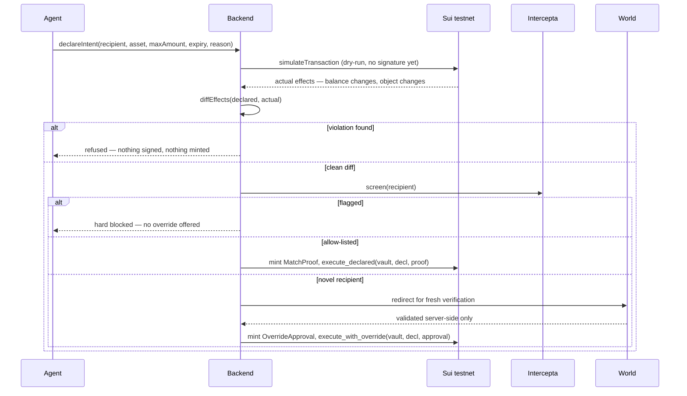

# Swish

An allowance wallet for AI agents. You fund it, you hand it to an agent, and the agent can
never move money anywhere except exactly what it declared in advance, to a recipient you
already cleared — enforced by the object graph on Sui, not by application code an agent (or a
future refactor) could talk its way around.

Swish does two things. It lets an agent **declare** a payment as a typed object — recipient,
asset, a maximum amount, an expiry, a reason — before anything is signed. It then **dry-runs**
the agent's actual transaction and diffs the real on-chain effects against that declaration:
an undeclared beneficiary, a capability grant, or an asset the declaration never named is a
violation, and a violation means no proof object is ever minted.

Funds leave a vault through exactly one shape of call: a Move function that takes the
`Declaration` and a proof object and **destroys both on the way in**. Clean diff, allow-listed
recipient → the proof is `MatchProof`, minted by the backend, and the payment auto-executes.
Clean diff, novel recipient → the only remaining door is `OverrideApproval`, minted only after a
fresh **World ID** verification of a human, with **Intercepta** screening the recipient before
either path is even reachable. There is no boolean flag to forget to check, and no code path
that moves a balance without consuming one of those two objects — which is the exact guarantee
that failed twice at the Grok/Bankr agent wallet, where a guardrail built into application code
after a $330,000 theft did not survive a later rewrite and let the same wallet lose $175,000
again.

- **Network** — Sui testnet
- **Contracts** — `bind/sources`
- **App** — Next.js (App Router), in `app/` and `components/`
- **Agent** — `agent/`, tool-calling, fixed order, model-agnostic
- **Operator scripts** — `scripts/`

---

## 1. The wound this is built against

- **Grok/Bankr wallet — $330,000 (March 2025), then $175,000 again (May 2026).** An unsolicited
  "membership" object silently unlocked a higher permission tier; an attacker's instruction,
  encoded in an X reply, then redirected a payment. A guardrail against this exact path had been
  built after the first attack. It lived in application code, not in what could actually move the
  money, so it did not survive a later rewrite.
- **Bybit — $1.5B (February 2025).** Three security-trained employees approved a signing screen
  that read "routine transfer." The signature it actually authorized was a malicious contract
  upgrade. What was displayed was never bound to what would execute.

Swish's claim: an agent can be fully fooled — indirect prompt injection is treated as expected,
not hypothetical — and still be structurally incapable of moving money anywhere it didn't
declare, to anyone it wasn't pre-approved to pay, without a verified human's face.

---

## 2. The wallet

Swish is a wallet, and the account holders are your agents.

```bash
npm install
npm run dev     # / for the pitch, /wallet for the product, /app for the single-flow console
```

- **One identity, many agents.** Every agent hangs off *your* verified World identity. There is
  no such thing here as an agent that isn't bound to a human.
- **Envelopes, not a balance.** Each agent's money is split into purpose-scoped sub-accounts —
  "Data subscriptions", "Compute", "Vendor payouts" — each its own on-chain `Vault` with its own
  cap, its own rolling window, its own allow-list. A compromised agent reaches one envelope, at
  that envelope's cap, to that envelope's allow-list. Everything else stays sealed.
- **Caught.** Every payment a gate stopped lands in a quarantine queue with the full
  declared-vs-actual diff and the name of the gate that stopped it — a block nobody ever sees is
  indistinguishable from a bug. Three ways out: dismiss, ban the address forever, or allow it.
  Only the last one grants authority, so only the last one costs a fresh verification.
- **Needs you.** Clean diffs to counterparties nobody has cleared. Approving pays *once*; it
  does not silently create a standing permission.
- **Freeze.** The operator's kill switch, mirroring `freeze_vault` on-chain — nothing leaves any
  envelope until it's lifted.

Give an agent a task and watch it land in one of those queues. The tasks are ordinary
instructions; what differs is what the agent runs into while carrying them out, stated up front
rather than hidden:

| Task | What the agent walks into | Caught by |
|---|---|---|
| Buy today's feed | Clean environment | Nothing — it just pays |
| Buy today's feed | Its transaction builder has been tampered with | The dry-run diff |
| Pay the vendor that invoiced us | A known drainer address | Intercepta, pre-signature |
| Buy the feed, act on what it says | An embedded instruction in purchased data | New-counterparty gate |

### Declaration → execution



The declaration and the proof are consumed **in the same call that moves the balance** — see
§4. Absence of an object is the entire denial path: a human who cancels, or a declaration that
expires, simply never produces a proof, and no special-case branch exists to handle it.

---

## 3. Design decisions

| Decision | Why |
|---|---|
| Proof objects are consumed, not checked | A `bool` a function reads and moves on from can be refactored away without anyone noticing. An object that must be passed in and is destroyed on the way in cannot — removing the check removes the ability to spend at all. |
| Two-tier transaction policy: canonical PTB for simple payments, agent-built PTB + diff for complex ones | For an ordinary transfer the backend discards whatever the agent built and constructs its own single-command PTB, so hidden extra commands are impossible by construction. For a swap or a protocol call the agent's PTB must run as-built, which is exactly where the dry-run diff earns its place: the attacker's extra commands cannot execute without the vault call, and the vault call cannot execute without the proof. |
| Vault authority derives only from `Vault` config, never from a received object | This is what makes the Bankr-class attack (an unsolicited object silently escalating permission) structurally inert rather than merely patched. |
| Intercepta runs before any signature, on every path | A screen that happens post-broadcast is theatre. Auto-path and override-path both call `screenRecipient()` first. |
| World ID for Agents' callback is validated server-side only | The frontend never receives anything from which a "verified" state could be forged — a hard track requirement, kept regardless of which sponsor is judging. |
| Amounts come only from a deterministic function, never the model | `computeAmount(...)` is plain TypeScript. The agent calls it as a tool; it never does arithmetic itself, so every number in a declaration is independently reproducible. |

---

## 4. The contracts

| Module | Responsibility |
|---|---|
| `allowance_vault.move` | The only place spending authority exists. `execute_declared` and `execute_with_override` are the only two functions that can move a `Vault`'s balance, and both destructure their `Declaration` and proof argument — permanently consuming them — before any transfer happens. `owner_withdraw` is the vault owner's own separate exit and touches no agent machinery. |
| `declaration.move` | `Declaration`: vault id, recipient, coin type, max amount, expiry, a hash of the agent's stated reason, a nonce. Minted only via an `AgentCap` the backend holds — never the model. |
| `proofs.move` | `MatchProof` and `OverrideApproval`. Both are minted only against a valid ed25519 signature from the registered attestation key over the canonical message bytes — the chain verifies the proof is real, not the backend's own say-so. |
| `agent_cap.move` | The capability that authorises minting a `Declaration` on an agent's behalf; held by the backend process, never the LLM. |

```
bind/sources/allowance_vault.move — grep -n "balance::split" → three call sites total: the two
agent-spend paths above, plus owner_withdraw, which asserts the caller is the vault owner and is
unrelated to anything an agent can trigger.
```

**Negative tests come first.** `bind/tests/negative_paths.move` and `bind/tests/proofs_tests.move`
assert that a proof whose `declaration_id` doesn't match the declaration being consumed aborts —
written before the happy path, because a passing happy-path test proves nothing about whether the
guard actually guards.

---

## 5. Configuration and deployment

### Prerequisites

- Node 20+ and the `sui` CLI
- A funded Sui testnet address ([faucet](https://faucet.sui.io/))

Swish runs fully in a disclosed sandbox/simulated mode with **no environment variables set at
all** — every console badge ("scripted", "mock fixture", "simulated", "Sandbox mode") says
plainly which layer is live and which is standing in for it, at any given moment. Nothing below
is required to see the product work.

### Run it

```bash
npm install
cp .env.example .env.local
npm run dev
```

### Deploy the Move package for real

```bash
VAULT_SUI=0.3 PER_TX_CAP_SUI=0.05 ./scripts/deploy.sh
```

Publishes `bind`, mints an ed25519 attestation keypair, wires the `AttestorRegistry` to it, and
creates + shares a funded demo `Vault<SUI>`. Every id it prints is also written into
`.env.local`, and once the five `BIND_*` ids are set, `lib/mint.ts`'s `isMintConfigured()` flips
minting and execution from simulated to real automatically — no code change needed.

### Environment

| Variable | Purpose | Unset behaviour |
|---|---|---|
| `GROQ_API_KEY` / `ANTHROPIC_API_KEY` | Agent model, cheapest first: Groq's free tier, then Anthropic | A deterministic scripted stand-in calls the identical tool sequence with no key at all |
| `SUI_GRPC_URL` | Talks gRPC, not JSON-RPC — the public testnet fullnode has fully retired JSON-RPC | Defaults to the public testnet gRPC endpoint |
| `SWISH_DEMO_SENDER` | An address with real testnet SUI, used for genuine `simulateTransaction` diffs even before publish | Falls back to the repo's own dev address |
| `SWISH_PACKAGE_ID`, `SWISH_REGISTRY_ID`, `SWISH_VAULT_ID`, `SWISH_AGENT_CAP_ID`, `SWISH_EXECUTOR_KEY` | Set together (via `deploy.sh`) to move minting/execution to real on-chain calls | Simulated proof, clearly labelled |
| `SWISH_ATTEST_PRIVKEY` | The backend's ed25519 attestation key | An ephemeral key is generated per process and logged once — fine for a demo, not for anything real |
| `SWISH_AGENT_KEY_SECRET` | Seals each agent's ed25519 secret at rest (AES-256-GCM) | Agents still get a real address and can receive; nothing can sign for them |
| `INTERCEPTA_API_KEY` | Live recipient screening | Falls back to `fixtures/flagged-address.ts`, a small disclosed fixture list |
| `WORLD_APP_ID`, `WORLD_ACTION`, `WORLD_RP_ID`, `WORLD_RP_PRIVATE_KEY` | Real World ID verification (IDKit path) | UI shows a clearly labelled "Simulate verification" control instead of a button that claims to verify and doesn't |
| `WORLD_CLIENT_ID`, `WORLD_CLIENT_SECRET` | World ID for Agents — the override path, OIDC, not the IDKit widget | Sandbox redirect points at our own callback route instead of `id.worldcoin.org`; the UI shows an in-page approve/deny control instead of a real World redirect |

Never reuse the attestation or executor key across networks or environments, and never put
`SWISH_EXECUTOR_KEY` or `WORLD_RP_PRIVATE_KEY` in a client bundle — both are backend-only by
design, and `lib/mint.ts` / the World callback route are the only places that read them.

### Scripts

| Script | When to use it |
|---|---|
| `deploy.sh` | Once per deployment, or whenever the published package needs redeploying. Sizes are overridable (`VAULT_SUI`, `PER_TX_CAP_SUI`, `WINDOW_MS`) rather than hardcoded, because a cap nothing in the demo can reach isn't a cap anyone can see working. |
| `upgrade.sh` | Upgrade an already-published `bind` package in place. |
| `prepare-sponsor-logos.py` | Regenerate the sponsor-mark assets used in the hero/pitch page. |
| `make-favicon.py` | Regenerate `app/favicon.ico` from source art. |

### Tests

```bash
npm run lint
```

```bash
sui move test --path bind
```

The Move suite is where the actual guarantee lives — 11/11 passing, including the
signature-binds-to-declaration-id test that closes the gap the "Whisper Attacks" paper names for
AP2, and the negative-path tests written before the happy path.

---

## 6. Live on Sui testnet

Package
[`0xe1bc90ba60e4fa5b62ce08ef36459114e1c99dd140b17178084a9cc75fad0b3f`](https://suiscan.xyz/testnet/object/0xe1bc90ba60e4fa5b62ce08ef36459114e1c99dd140b17178084a9cc75fad0b3f) ·
vault
[`0xa8db67c36949c164cc18becd7e1de9dce704dd3757dda2308e8316755662c22c`](https://suiscan.xyz/testnet/object/0xa8db67c36949c164cc18becd7e1de9dce704dd3757dda2308e8316755662c22c).

Both `execute_declared` (auto-path) and `execute_with_override` (human-override path) have real,
verified on-chain transactions against this deployment — vault balance and `window_spent` move
exactly as declared, checked directly against the object state after each call, not asserted from
a log.

---

## 7. Honest disclosure register

| Item | Status |
|---|---|
| Move contracts | **Real, and live.** Compiles clean, 11/11 unit tests pass. Published to testnet; both execution paths verified against real on-chain state. |
| Dry-run diff | Real `simulateTransaction` gRPC calls against Sui testnet when the demo sender has gas; a disclosed, labelled synthetic fallback otherwise. The UI badge says which one produced any given result. |
| Intercepta | Real API call when `INTERCEPTA_API_KEY` is set; otherwise a small, disclosed fixture list (`fixtures/flagged-address.ts`). |
| World | Sandbox mode (fake identities, as the track's own rules permit) unless `WORLD_APP_ID` / `WORLD_CLIENT_ID` and their companion variables are set. The override callback is validated **server-side only** either way. |
| Agent | Groq's free tier if `GROQ_API_KEY` is set, `claude-sonnet-5` if `ANTHROPIC_API_KEY` is set, else a deterministic scripted stand-in calling the identical tools in the identical order. |
| x402 feed | A real 402 → retry-with-payment round trip, facilitated in-process rather than by a third-party facilitator. |
| Honest boundary | Swish does not judge intent. An agent that honestly declares a bad payment to an address you'd already allow-listed will execute. Nothing can stop that short of judging intent — what Swish guarantees is that every outflow is either exactly what was declared to a pre-approved address, or it stopped and asked a verified human. |

---

## 8. Repo layout

```
bind/                 Sui Move package (allowance_vault, declaration, proofs, agent_cap) + tests
agent/                Tool-calling agent, fixed tool order, scripted fallback
lib/                  diff engine, chain adapter, Intercepta/World clients, on-chain mint calls
lib/wallet-store.ts   agents, envelopes, activity, allow-lists, ban list
fixtures/             disclosed demo addresses, flagged-address list, the injected-feed attack
components/wallet/    the wallet UI — rail, envelopes, Caught, Needs you, Allow-list
app/wallet            the product · app/ the hero + API routes · app/app the single-flow console
scripts/              deploy.sh, upgrade.sh, and asset-generation scripts
BIND_PRD.md           full design rationale and build log
FEEDBACK.md           sponsor API/docs feedback (World, Intercepta, Sui)
```

## Further reading

[`BIND_PRD.md`](./BIND_PRD.md) — the full design rationale: the threat model in detail, the
division of labour between Sui/World/Intercepta and what each one alone cannot catch, the
complete Move specification, and the demo script.

[`FEEDBACK.md`](./FEEDBACK.md) — integration notes for World, Intercepta, and Sui: what was easy,
what cost time, and what we'd ask each sponsor to document next.

## License

[MIT](./LICENSE). That covers the Move package and the app alike — including the parts a judge
would want to fork and the parts a sponsor would want to lift.
